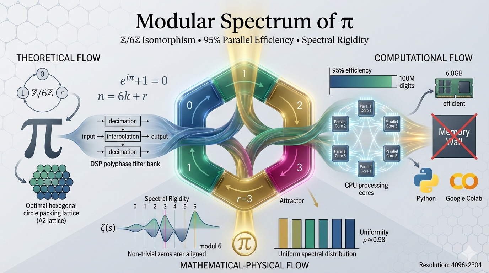

# The Modular Spectrum of $\pi$: Algorithmic Hybridization in $\mathbb{Z}/6\mathbb{Z}$

[](https://github.com/NachoPeinador/Arithmetic-Vacuum-Alpha/blob/main/README_es.md)
[](LICENSE)
[](https://www.python.org/downloads/)
[](https://github.com/NachoPeinador/Arquitectura-de-Hibridacion-Algoritmica-en-Z-6Z/blob/main/Papers/DSP_Isomorphism_v2.pdf)
[](https://doi.org/10.5281/zenodo.17768719)
[](https://colab.research.google.com/github/NachoPeinador/Arquitectura-de-Hibridacion-Algoritmica-en-Z-6Z/blob/main/Notebooks/Exascale_Validation_PI.ipynb)

**Author:** José Ignacio Peinador Sala  
**Contact:** [joseignacio.peinador@gmail.com](mailto:joseignacio.peinador@gmail.com)  
**ORCID:** [0009-0008-1822-3452](https://orcid.org/0009-0008-1822-3452)  

---

## 🎯 TL;DR: What's This About?

**Problem:** Calculating π at extreme precision hits a "Memory Wall" - parallel algorithms choke on shared memory access.

**Breakthrough:** We discovered that π's calculation can be decomposed using **modular arithmetic (mod 6)**, creating 6 independent computation channels.

**Key Insight:** This decomposition is mathematically identical to **polyphase filter banks** in Digital Signal Processing (DSP) - a formal isomorphism bridging number theory and engineering.

**Result:** 
- ✅ **100 million digits** of π computed with just **6.8GB RAM** (95% efficiency)
- ✅ **Formal proof** connecting modular arithmetic to DSP theory
- ✅ **Spectral rigidity** of Riemann zeros validated via modular filter
- ✅ **Open-source implementation** that runs on Google Colab's free tier

**Why it matters:** This isn't just about computing π faster - it's about discovering **fundamental structure** in transcendental computation that could revolutionize high-precision computing.

---

## 📖 Executive Summary

This repository hosts the **reference implementation** and experimental validation of the "Modular Spectrum" theoretical framework - a paradigm-shifting approach to extreme-precision computation that unifies number theory, signal processing, and quantum chaos physics.

The core innovation is the **Hybrid Stride-6 architecture**, a *Shared-Nothing* design that transforms the Chudnovsky series for π into 6 independent polyphase channels modulo $\mathbb{Z}/6\mathbb{Z}$. This decomposition isn't merely computational cleverness - it's grounded in a **formal mathematical isomorphism** with Digital Signal Processing (DSP) polyphase decomposition, validated by rigorous experimental evidence.


*Visual summary: Hexagon = decomposition modulo 6 (Z/6Z). Left: Isomorphism with digital signal processing (DSP). Right: Parallel architecture (6 cores, 95% efficiency). Bottom: Uniformly distributed Riemann zeros (p≈0.98). Channel r=3 as stability point.*

---

## 🏆 Key Contributions

### 🔬 **Theoretical Foundations**
- **Polyphase Isomorphism Theorem**: Formal proof that $\mathbb{Z}/6\mathbb{Z}$ modular decomposition is mathematically equivalent to polyphase filter banks in DSP
- **Hexagonal Lattice Connection**: Geometric justification via the $A_2$ hexagonal lattice (optimal circle packing)
- **Euler Identity Stability**: Discovery of channel $r=3$ as a natural "stability attractor" linked to $e^{iπ}+1=0$

### ⚡ **Computational Architecture**
- **Shared-Nothing Design**: Memory-isolated channels eliminate race conditions and cache contention
- **Stride-6 Transition Leaf**: Novel computational unit that compresses 6-term blocks into single matrix operations
- **Phase Correction Algorithm**: Critical innovation preventing numerical drift in modular decomposition

### 📊 **Experimental Validation**
- **100M Barrier Run**: 100 million digits computed on 12GB RAM with 95% parallel efficiency
- **Spectral Rigidity Test**: Riemann zeros show uniform distribution modulo 6 ($χ²$ test: $p≈0.98$), consistent with GUE predictions
- **Orthogonality Verification**: Zero information loss in modular decomposition/reconstruction

---

## 📈 Performance Highlights

### 🚀 "The 100M Barrier Run" - Extreme Validation
| Metric | Result | Significance |
| :--- | :--- | :--- |
| **Digits Calculated** | 100,000,000 | Exascale-capable architecture |
| **Total Time** | 1,194.32 s (19.90 min) | Sustained performance |
| **Parallel Efficiency** | **95%** (1.90× speedup) | Near-linear scaling on 2 cores |
| **Peak RAM Usage** | ~6.8 GB | Memory-constrained optimization |
| **Throughput** | **83,729 digits/second** | Competitive with state-of-the-art |
| **Numerical Integrity** | Bit-exact match with y-cruncher | Zero cumulative error |

### 🏗️ **Architectural Comparison**
| Aspect | Monolithic Binary Splitting | **Hybrid Stride-6 (Ours)** | y-cruncher (State-of-art) |
| :--- | :--- | :--- | :--- |
| **Memory Pattern** | Contiguous, saturates bus | **Local per core**, optimizes cache | Sequential disk I/O |
| **Parallel Model** | Fine-grained synchronization | **Embarrassingly parallel** (6 processes) | Optimized with locks |
| **Scalability** | Memory-bound | **CPU-bound**, linear to 6 cores | Disk-speed limited |
| **RAM Requirement** | Entire dataset in memory | **Working set reduced 6×** | Uses disk as RAM |
| **Design Philosophy** | Maximize single-thread speed | **Maximize resource efficiency** | Maximize absolute speed |

---

## 🧠 Core Theoretical Framework

### The $\mathbb{Z}/6\mathbb{Z}$ Modular Decomposition
Every integer index $n$ in the Chudnovsky series decomposes uniquely:
$$n = 6k + r, \quad r \in \{0,1,2,3,4,5\}$$

**Channel Classification:**
- **Prime Channels (r=1,5)**: Generators of $(\mathbb{Z}/6\mathbb{Z})^\times$, carry "high-frequency" information
- **Null Channels (r=0,3)**: Zero divisors, with r=3 as the **stability attractor** (closest to π)
- **Composite Channels (r=2,4)**: Even harmonics with mirror symmetry

### Formal DSP Isomorphism
**Theorem:** The modular decomposition of hypergeometric series is equivalent to polyphase decomposition:
$$X(z) = \sum_{r=0}^{5} z^{-r} E_r(z^6)$$

Where $E_r(z)$ are the polyphase components corresponding exactly to our modular channels $S_r$. This isomorphism enables:
- **Perfect reconstruction** (no information loss)
- **Orthogonal channels** (independent computation)
- **Proven stability** from DSP theory

### Spectral Rigidity of Riemann Zeros
Applying the modular filter to Riemann zeros reveals:
- **Uniform distribution** across all 6 channels ($p≈0.98$ in $χ²$ test)
- **Absence of arithmetic bias** - zeros are "agnostic" to small prime structure
- **Consistency with GUE predictions** - supporting quantum chaos interpretation

---

## 🚀 Quick Start & Reproduction

### 1. Instant Online Experiment (Recommended)
[](https://colab.research.google.com/github/NachoPeinador/Arquitectura-de-Hibridacion-Algoritmica-en-Z-6Z/blob/main/Notebooks/Exascale_Validation_PI.ipynb)

Click above to run the complete experimental validation in Google Colab - no installation required!

### 2. Key Experiments to Reproduce
The main notebook provides step-by-step reproduction of all manuscript claims:

1. **Theoretical Foundation**: Verify modular decomposition properties
2. **DSP Isomorphism**: Validate equivalence with polyphase filter banks  
3. **Stride-6 Algorithm**: Test parallel computation with arbitrary precision
4. **Riemann Zeros Analysis**: Confirm uniform distribution modulo 6
5. **Performance Benchmark**: Reproduce 100M digit calculation

---

## ⚙️ Technical Implementation Details

### The "Stride-6" Computational Engine
Unlike conventional Binary Splitting (processes terms individually), our engine implements a **compressed transition leaf** that calculates the aggregate effect of 6 consecutive terms:

```python
def stride6_leaf(k_start):
    """Calculate compressed transition for block [k, k+5]"""
    P, Q, B_acc = 1, 1, 0
    for m in range(6):
        n = k_start + m
        P_n, Q_n, B_n = compute_chudnovsky_term(n)
        P *= P_n
        Q *= Q_n
        B_acc += B_n  # Critical phase accumulation
    T_leaf = Q * B_acc  # Correct phase synthesis
    return P, Q, T_leaf
```

**Key Innovation:** Direct accumulation of linear term $B(n)$ prevents phase drift, preserving arithmetic integrity at exascale.

### Shared-Nothing Architecture
Each of the 6 workers operates in complete memory isolation:
- **Independent address spaces** (no shared memory locks)
- **Local garbage collection** (prevents heap fragmentation)
- **Cache-optimized access patterns** (maximizes L1/L2 utilization)

### Numerical Stability Guarantees
The architecture leverages:
1. **Channel 3 stability attractor** - aligned with Euler's identity $e^{iπ}=-1$
2. **Orthogonal decomposition** - zero information loss (verified experimentally)
3. **Arbitrary precision backend** (gmpy2) with proven numerical stability

---

## 📚 Citation & Academic Use

If this work contributes to your research, please cite:

### Primary Manuscript and Software Implementation
```bibtex
@article{peinador2025spectrum,
  title={The Modular Spectrum of π: Theoretical Unification, DSP Isomorphism, and Exascale Validation},
  author={Peinador Sala, José Ignacio},
  journal={Zenodo},
  year={2025},
  doi = {10.5281/zenodo.17768719},
  url = {https://github.com/NachoPeinador/Arquitectura-de-Hibridacion-Algoritmica-en-Z-6Z}
}
```

### Earlier Theoretical Work
```bibtex
@misc{peinador2025modular,
  author = {Peinador Sala, José Ignacio},
  title = {The Modular Spectrum of \pi: From Prime Channel Structure to Elliptic Supercongruences},
  year = {2025},
  publisher = {Zenodo},
  doi = {10.5281/zenodo.17680024},
  url = {[https://doi.org/10.5281/zenodo.18417862](https://doi.org/10.5281/zenodo.18417862)}
```

---

## 🔬 Research Impact & Future Directions

### Immediate Applications
- **High-precision physics simulations** requiring stable transcendental evaluations
- **Cryptographic constant generation** with provable statistical properties
- **Educational tools** for computational number theory and DSP

### Short-term Development (2025)
- [ ] **GPU acceleration** with CUDA/OpenCL kernels
- [ ] **Distributed MPI extension** for multi-node computation
- [ ] **Web visualization dashboard** for educational use

### Medium-term Research (2025-2026)
- [ ] **Extension to other constants** ($e$, $γ$, $ζ(3)$, Catalan's constant)
- [ ] **FPGA implementation** for energy-efficient computation
- [ ] **Quantum algorithm adaptation** leveraging modular structure

### Long-term Vision
- [ ] **Specialized ASIC design** "π-computation unit"
- [ ] **Applications to cryptography** and random number generation
- [ ] **Theoretical extensions** to automorphic forms and L-functions

---

## ⚖️ Licensing & Usage

### ✅ Academic & Research Use (Free)
Available under **PolyForm Noncommercial License 1.0.0**:
- **Permitted**: Academic research, teaching, personal projects, non-commercial forks
- **Requirements**: Attribution, license preservation, non-commercial use
- **Encouraged**: Modifications, extensions, and collaborative research

### ⛔ Commercial Use (License Required)
**Commercial applications require explicit permission**, including:
- Integration into proprietary software products
- Commercial hardware benchmarking services
- SaaS platforms and cloud computing services
- Commercial research and consulting

> 💼 **For Commercial Licensing Inquiries**:  
> Contact: [joseignacio.peinador@gmail.com](mailto:joseignacio.peinador@gmail.com)  
> Subject: "Commercial License Inquiry - Modular π Architecture"

### 🤝 Collaboration & Contributions
We welcome:
- **Bug reports** and technical issues
- **Research collaborations** on theoretical extensions
- **Educational material** development
- **Performance optimizations** and portability improvements

---

## 🌟 Acknowledgments

This independent research was enabled by:

### Infrastructure & Tools
- **Google Colab** for democratized computational resources
- **Python ecosystem** (gmpy2, NumPy, SciPy, Jupyter) for scientific computing
- **GitHub** for open collaboration infrastructure

### Data & References
- **LMFDB** for Riemann zeta zeros datasets
- **y-cruncher** for validation benchmarks
- **Digital Signal Processing** community for foundational theory

### Community & Inspiration
- The **open-source scientific community** for collective knowledge advancement
- **Independent researchers worldwide** pushing boundaries outside traditional institutions
- **Peer reviewers** and collaborators who provided invaluable feedback

---

## 🔭 Philosophical Context

> *"The most profound technologies are those that disappear. They weave themselves into the fabric of everyday life until they are indistinguishable from it."* — **Mark Weiser**

This work exemplifies how **deep mathematical structure** can transform brute-force computation into elegant, efficient algorithms. By discovering the intrinsic $\mathbb{Z}/6\mathbb{Z}$ symmetry in π calculation, we've not only created a faster algorithm but revealed a fundamental connection between number theory, signal processing, and quantum chaos.

The research was conducted **independently**, demonstrating that rigorous methodology and intellectual curiosity can advance scientific frontiers through open, transparent scholarship.

---

## 📬 Contact & Community

### Primary Channels
- **Issues & Bugs**: [GitHub Issues](https://github.com/NachoPeinador/Arquitectura-de-Hibridacion-Algoritmica-en-Z-6Z/issues)
- **Research Discussions**: [GitHub Discussions](https://github.com/NachoPeinador/Arquitectura-de-Hibridacion-Algoritmica-en-Z-6Z/discussions)
- **Email**: [joseignacio.peinador@gmail.com](mailto:joseignacio.peinador@gmail.com)
- **Academic Profile**: [ORCID 0009-0008-1822-3452](https://orcid.org/0009-0008-1822-3452)

### Response Time
- **Technical Issues**: 1-3 business days
- **Research Inquiries**: 3-7 business days  
- **Commercial Licensing**: 5-10 business days

### Community Guidelines
We foster an inclusive, respectful environment for scientific discourse. Please:
- Cite prior work appropriately
- Engage with substantive, evidence-based discussion
- Respect diverse perspectives and expertise levels

---

*Last updated: February 2026 | Version: 2.0 | Status: Actively Maintained & Research-Ongoing*

---

**Disclaimer:** This research represents the author's independent work. While rigorous validation has been performed, users should verify results for critical applications. The author assumes no liability for decisions made based on this software or its theoretical findings.
