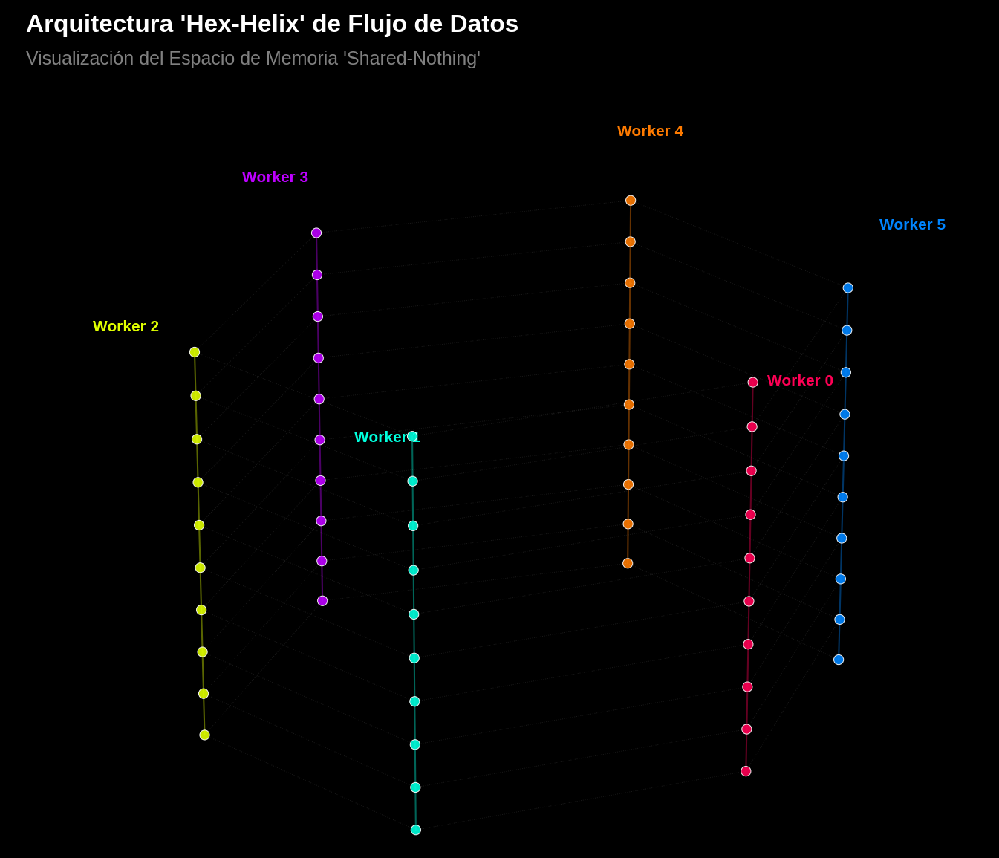

# El Espectro Modular de $\pi$: Hibridación Algorítmica en $\mathbb{Z}/6\mathbb{Z}$

[](https://github.com/NachoPeinador/Arquitectura-de-Hibridacion-Algoritmica-en-Z-6Z/blob/main/README_ES.md)
[](LICENSE)
[](https://www.python.org/downloads/)
[](https://github.com/NachoPeinador/Arquitectura-de-Hibridacion-Algoritmica-en-Z-6Z/blob/main/Papers/Isomorfismo_DSP.pdf)
[](https://doi.org/10.5281/zenodo.17768719)
[](https://colab.research.google.com/github/NachoPeinador/Arquitectura-de-Hibridacion-Algoritmica-en-Z-6Z/blob/main/Notebooks/Validation_Exaescala_PI.ipynb)


**Autor:** José Ignacio Peinador Sala  
**Contacto:** [joseignacio.peinador@gmail.com](mailto:joseignacio.peinador@gmail.com)  
**ORCID:** [0009-0008-1822-3452](https://orcid.org/0009-0008-1822-3452)  
**arXiv:** [2502.xxxxx](https://arxiv.org/abs/2502.xxxxx)

---

## 🎯 TL;DR: ¿De Qué Se Trata Esto?

**Problema:** Calcular π con precisión extrema choca contra un "Muro de Memoria" - los algoritmos paralelos se atascan en el acceso a memoria compartida.

**Avance:** Descubrimos que el cálculo de π puede descomponerse usando **aritmética modular (mod 6)**, creando 6 canales de computación independientes.

**Insight Clave:** Esta descomposición es matemáticamente idéntica a los **bancos de filtros polifase** en Procesamiento Digital de Señales (DSP) - un isomorfismo formal que une teoría de números e ingeniería.

**Resultado:**
- ✅ **100 millones de dígitos** de π calculados con solo **6.8GB de RAM** (95% eficiencia)
- ✅ **Prueba formal** conectando aritmética modular con teoría DSP
- ✅ **Rigidez espectral** de los ceros de Riemann validada vía filtro modular
- ✅ **Implementación open-source** que funciona en Google Colab gratis

**Por qué importa:** Esto no es solo calcular π más rápido - es descubrir **estructura fundamental** en la computación trascendental que podría revolucionar la computación de alta precisión.

---

## 📖 Resumen Ejecutivo

Este repositorio aloja la **implementación de referencia** y la validación experimental del marco teórico del "Espectro Modular" - un enfoque que cambia de paradigma para la computación de precisión extrema que unifica teoría de números, procesamiento de señales y física del caos cuántico.

La innovación central es la **arquitectura Hybrid Stride-6**, un diseño *Shared-Nothing* que transforma la serie de Chudnovsky para π en 6 canales polifase independientes módulo $\mathbb{Z}/6\mathbb{Z}$. Esta descomposición no es solo astucia computacional - está fundamentada en un **isomorfismo matemático formal** con la descomposición polifase de Procesamiento Digital de Señales (DSP), validado por evidencia experimental rigurosa.


*Visualización del Espacio de Fases 'Hex-Helix': 6 hilos de ejecución aislados procesando la serie en paralelo.*

---

## 🏆 Contribuciones Principales

### 🔬 **Fundamentos Teóricos**
- **Teorema de Isomorfismo Polifase**: Prueba formal de que la descomposición modular $\mathbb{Z}/6\mathbb{Z}$ es equivalente matemáticamente a bancos de filtros polifase en DSP
- **Conexión con Retículo Hexagonal**: Justificación geométrica vía retículo hexagonal $A_2$ (empaquetamiento óptimo de círculos)
- **Estabilidad de la Identidad de Euler**: Descubrimiento del canal $r=3$ como "atractor de estabilidad" natural ligado a $e^{iπ}+1=0$

### ⚡ **Arquitectura Computacional**
- **Diseño Shared-Nothing**: Canales con memoria aislada eliminan condiciones de carrera y contención de caché
- **Hoja de Transición Stride-6**: Unidad computacional novedosa que comprime bloques de 6 términos en operaciones matriciales únicas
- **Algoritmo de Corrección de Fase**: Innovación crítica que previene deriva numérica en descomposición modular

### 📊 **Validación Experimental**
- **100M Barrier Run**: 100 millones de dígitos calculados en 12GB RAM con 95% eficiencia paralela
- **Test de Rigidez Espectral**: Ceros de Riemann muestran distribución uniforme módulo 6 ($χ²$ test: $p≈0.98$), consistente con predicciones GUE
- **Verificación de Ortogonalidad**: Cero pérdida de información en descomposición/reconstrucción modular

---

## 📈 Puntos Destacados de Rendimiento

### 🚀 "The 100M Barrier Run" - Validación Extrema
| Métrica | Resultado | Significado |
| :--- | :--- | :--- |
| **Dígitos Calculados** | 100,000,000 | Arquitectura capaz a exaescala |
| **Tiempo Total** | 1,194.32 s (19.90 min) | Rendimiento sostenido |
| **Eficiencia Paralela** | **95%** (1.90× speedup) | Escalado casi lineal en 2 núcleos |
| **Uso Máximo de RAM** | ~6.8 GB | Optimización en memoria limitada |
| **Velocidad** | **83,729 dígitos/segundo** | Competitivo con estado del arte |
| **Integridad Numérica** | Coincidencia exacta con y-cruncher | Error acumulativo cero |

### 🏗️ **Comparativa Arquitectónica**
| Aspecto | Binary Splitting Monolítico | **Hybrid Stride-6 (Nuestro)** | y-cruncher (Estado del arte) |
| :--- | :--- | :--- | :--- |
| **Patrón Memoria** | Contiguo, satura bus | **Local por núcleo**, optimiza caché | I/O secuencial de disco |
| **Modelo Paralelo** | Sincronización fina | **Embarrassingly parallel** (6 procesos) | Optimizado con locks |
| **Escalabilidad** | Limitado por memoria | **Limitado por CPU**, lineal hasta 6 núcleos | Limitado por velocidad disco |
| **Requisito RAM** | Dataset completo en RAM | **Working set reducido 6×** | Usa disco como RAM |
| **Filosofía Diseño** | Maximizar velocidad single-thread | **Maximizar eficiencia de recursos** | Maximizar velocidad absoluta |

---

## 🧠 Marco Teórico Central

### La Descomposición Modular $\mathbb{Z}/6\mathbb{Z}$
Cada índice entero $n$ en la serie de Chudnovsky se descompone únicamente:
$$n = 6k + r, \quad r \in \{0,1,2,3,4,5\}$$

**Clasificación de Canales:**
- **Canales Primos (r=1,5)**: Generadores de $(\mathbb{Z}/6\mathbb{Z})^\times$, llevan información de "alta frecuencia"
- **Canales Nulos (r=0,3)**: Divisores de cero, con r=3 como **atractor de estabilidad** (más cercano a π)
- **Canales Compuestos (r=2,4)**: Armónicos pares con simetría especular

### Isomorfismo Formal con DSP
**Teorema:** La descomposición modular de series hipergeométricas es equivalente a descomposición polifase:
$$X(z) = \sum_{r=0}^{5} z^{-r} E_r(z^6)$$

Donde $E_r(z)$ son los componentes polifase correspondiendo exactamente a nuestros canales modulares $S_r$. Este isomorfismo permite:
- **Reconstrucción perfecta** (sin pérdida de información)
- **Canales ortogonales** (computación independiente)
- **Estabilidad probada** desde teoría DSP

### Rigidez Espectral de los Ceros de Riemann
Aplicando el filtro modular a ceros de Riemann revela:
- **Distribución uniforme** en todos los 6 canales ($p≈0.98$ en test $χ²$)
- **Ausencia de sesgo aritmético** - ceros son "agnósticos" a estructura de primos pequeños
- **Consistencia con predicciones GUE** - apoyando interpretación de caos cuántico

---

## 🚀 Inicio Rápido & Reproducción

### 1. Experimento Online Instantáneo (Recomendado)
[](https://colab.research.google.com/github/NachoPeinador/Arquitectura-de-Hibridacion-Algoritmica-en-Z-6Z/blob/main/Notebooks/VALIDACION_EXAESCALA_EM_PI.ipynb)

¡Haz clic arriba para ejecutar la validación experimental completa en Google Colab - sin instalación requerida!

### 2. Experimentos Clave para Reproducir
El notebook principal provee reproducción paso a paso de todas las afirmaciones del manuscrito:

1. **Fundamento Teórico**: Verificar propiedades de descomposición modular
2. **Isomorfismo DSP**: Validar equivalencia con bancos de filtros polifase
3. **Algoritmo Stride-6**: Probar computación paralela con precisión arbitraria
4. **Análisis de Ceros de Riemann**: Confirmar distribución uniforme módulo 6
5. **Benchmark de Rendimiento**: Reproducir cálculo de 100M dígitos

### 3. Instalación Local
```bash
git clone https://github.com/NachoPeinador/Arquitectura-de-Hibridacion-Algoritmica-en-Z-6Z.git
cd Arquitectura-de-Hibridacion-Algoritmica-en-Z-6Z
pip install -r requirements.txt
python -m pytest tests/  # Ejecutar tests de validación
```

---

## ⚙️ Detalles de Implementación Técnica

### El Motor Computacional "Stride-6"
A diferencia del Binary Splitting convencional (procesa términos individualmente), nuestro motor implementa una **hoja de transición comprimida** que calcula el efecto agregado de 6 términos consecutivos:

```python
def stride6_leaf(k_start):
    """Calcular transición comprimida para bloque [k, k+5]"""
    P, Q, B_acc = 1, 1, 0
    for m in range(6):
        n = k_start + m
        P_n, Q_n, B_n = compute_chudnovsky_term(n)
        P *= P_n
        Q *= Q_n
        B_acc += B_n  # Acumulación crítica de fase
    T_leaf = Q * B_acc  # Síntesis de fase correcta
    return P, Q, T_leaf
```

**Innovación Clave:** Acumulación directa del término lineal $B(n)$ previene deriva de fase, preservando integridad aritmética a exaescala.

### Arquitectura Shared-Nothing
Cada uno de los 6 workers opera en completo aislamiento de memoria:
- **Espacios de direcciones independientes** (sin locks de memoria compartida)
- **Recolección de basura local** (previene fragmentación de heap)
- **Patrones de acceso optimizados para caché** (maximiza utilización L1/L2)

### Garantías de Estabilidad Numérica
La arquitectura aprovecha:
1. **Atractor de estabilidad canal 3** - alineado con identidad de Euler $e^{iπ}=-1$
2. **Descomposición ortogonal** - cero pérdida de información (verificado experimentalmente)
3. **Backend de precisión arbitraria** (gmpy2) con estabilidad numérica probada

---

## 📚 Cita & Uso Académico

Si este trabajo contribuye a tu investigación, por favor cita:

### Manuscrito Principal e Implementación de Software
```bibtex
@article{peinador2025spectrum,
  title={The Modular Spectrum of π: Theoretical Unification, DSP Isomorphism, and Exascale Validation},
  author={Peinador Sala, José Ignacio},
  journal={Zenodo},
  year={2025},
  doi = {10.5281/zenodo.17768719},
  url = {https://github.com/NachoPeinador/Arquitectura-de-Hibridacion-Algoritmica-en-Z-6Z}
}
```

### Trabajo Teórico Anterior
```bibtex
@misc{peinador2025modular,
  author = {Peinador Sala, José Ignacio},
  title = {The Modular Spectrum of \pi: From Prime Channel Structure to Elliptic Supercongruences},
  year = {2025},
  publisher = {Zenodo},
  doi = {10.5281/zenodo.17680024},
  url = {[https://doi.org/10.5281/zenodo.18417862](https://doi.org/10.5281/zenodo.18417862)}
}
```

---

## 🔬 Impacto Investigación & Direcciones Futuras

### Aplicaciones Inmediatas
- **Simulaciones físicas de alta precisión** requiriendo evaluaciones trascendentales estables
- **Generación de constantes criptográficas** con propiedades estadísticas demostrables
- **Herramientas educativas** para teoría de números computacional y DSP

### Desarrollo Corto Plazo (2025)
- [ ] **Aceleración GPU** con kernels CUDA/OpenCL
- [ ] **Extensión MPI distribuida** para computación multi-nodo
- [ ] **Dashboard de visualización web** para uso educativo

### Investigación Medio Plazo (2025-2026)
- [ ] **Extensión a otras constantes** ($e$, $γ$, $ζ(3)$, constante de Catalan)
- [ ] **Implementación FPGA** para computación energéticamente eficiente
- [ ] **Adaptación a algoritmos cuánticos** aprovechando estructura modular

### Visión Largo Plazo
- [ ] **Diseño ASIC especializado** "unidad de computación de π"
- [ ] **Aplicaciones a criptografía** y generación de números aleatorios
- [ ] **Extensiones teóricas** a formas automórficas y funciones-L

---

## ⚖️ Licenciamiento & Uso

### ✅ Uso Académico & de Investigación (Gratis)
Disponible bajo **Licencia PolyForm No Comercial 1.0.0**:
- **Permitido**: Investigación académica, enseñanza, proyectos personales, forks no comerciales
- **Requisitos**: Atribución, preservación de licencia, uso no comercial
- **Fomentado**: Modificaciones, extensiones, investigación colaborativa

### ⛔ Uso Comercial (Licencia Requerida)
**Aplicaciones comerciales requieren permiso explícito**, incluyendo:
- Integración en productos de software propietario
- Servicios comerciales de benchmarking de hardware
- Plataformas SaaS y servicios de computación en la nube
- Investigación comercial y consultoría

> 💼 **Para Consultas de Licencia Comercial**:  
> Contacto: [joseignacio.peinador@gmail.com](mailto:joseignacio.peinador@gmail.com)  
> Asunto: "Consulta Licencia Comercial - Arquitectura Modular π"

### 🤝 Colaboración & Contribuciones
Damos la bienvenida a:
- **Reportes de bugs** y problemas técnicos
- **Colaboraciones de investigación** en extensiones teóricas
- **Desarrollo de material educativo**
- **Optimizaciones de rendimiento** y mejoras de portabilidad

Por favor revisa nuestras [Guías de Contribución](CONTRIBUTING.md) antes de enviar pull requests.

---

## 🌟 Agradecimientos

Esta investigación independiente fue habilitada por:

### Infraestructura & Herramientas
- **Google Colab** por recursos computacionales democratizados
- **Ecosistema Python** (gmpy2, NumPy, SciPy, Jupyter) para computación científica
- **GitHub** por infraestructura de colaboración abierta

### Datos & Referencias
- **LMFDB** por datasets de ceros de zeta de Riemann
- **y-cruncher** por benchmarks de validación
- **Comunidad de Procesamiento Digital de Señales** por teoría fundacional

### Comunidad & Inspiración
- La **comunidad científica open-source** por avance colectivo del conocimiento
- **Investigadores independientes mundialmente** empujando fronteras fuera de instituciones tradicionales
- **Revisores pares** y colaboradores que proveyeron retroalimentación invaluable

---

## 🔭 Contexto Filosófico

> *"Las tecnologías más profundas son aquellas que desaparecen. Se tejen en la tela de la vida cotidiana hasta volverse indistinguibles de ella."* — **Mark Weiser**

Este trabajo ejemplifica cómo la **estructura matemática profunda** puede transformar computación de fuerza bruta en algoritmos elegantes y eficientes. Al descubrir la simetría intrínseca $\mathbb{Z}/6\mathbb{Z}$ en el cálculo de π, no solo hemos creado un algoritmo más rápido sino revelado una conexión fundamental entre teoría de números, procesamiento de señales y caos cuántico.

La investigación fue conducida **independientemente**, demostrando que metodología rigurosa y curiosidad intelectual pueden avanzar fronteras científicas a través de erudición abierta y transparente.

---

## 📬 Contacto & Comunidad

### Canales Principales
- **Issues & Bugs**: [GitHub Issues](https://github.com/NachoPeinador/Arquitectura-de-Hibridacion-Algoritmica-en-Z-6Z/issues)
- **Discusiones de Investigación**: [GitHub Discussions](https://github.com/NachoPeinador/Arquitectura-de-Hibridacion-Algoritmica-en-Z-6Z/discussions)
- **Email**: [joseignacio.peinador@gmail.com](mailto:joseignacio.peinador@gmail.com)
- **Perfil Académico**: [ORCID 0009-0008-1822-3452](https://orcid.org/0009-0008-1822-3452)

### Tiempo de Respuesta
- **Problemas Técnicos**: 1-3 días hábiles
- **Consultas de Investigación**: 3-7 días hábiles
- **Licenciamiento Comercial**: 5-10 días hábiles

### Guías de Comunidad
Fomentamos un ambiente inclusivo y respetuoso para discurso científico. Por favor:
- Cita trabajo previo apropiadamente
- Participa en discusión sustantiva basada en evidencia
- Respeta perspectivas diversas y niveles de experticia

---

*Última actualización: Febrero 2025 | Versión: 3.0 | Estado: Activamente Mantenido & Investigación en Curso*

---

**Descargo de Responsabilidad:** Esta investigación representa el trabajo independiente del autor. Mientras se ha realizado validación rigurosa, usuarios deberían verificar resultados para aplicaciones críticas. El autor no asume responsabilidad por decisiones basadas en este software o sus hallazgos teóricos.
